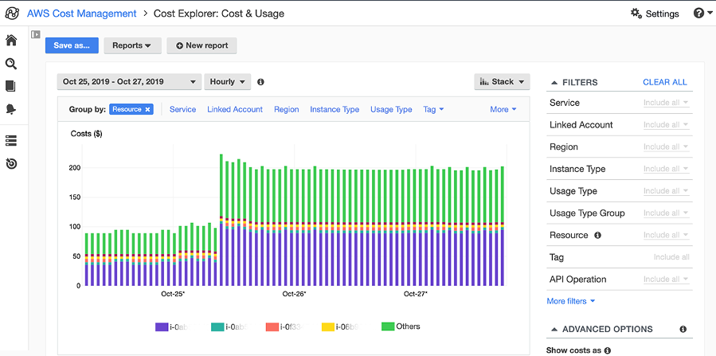

# AWS Brasil - Conteúdo da série de Webinars para Educação apresentados em 2020

## Como reduzir seus custos na AWS com 10 dicas simples (07/05)

Neste segundo webinar, da série do segmento de Educação, falamos sobre 10 dicas simples que podem impactar sua fatura no fim do mês. Confira as 10 dicas em anexo na apresentação que se encontra nessa mesma pasta.

Essas foram 10 dicas que deixamos para apoiá-los em sua jornada de redução de custo. Lembrando que a redução de custo não se limita a esses 10 itens, possui muito mais coisas que podemos fazer para reduzir o valor da conta mensal. Quando trabalhamos com cloud e AWS nosso custo deve estar sempre otimizado, e conseguimos garantir isso através do provisionamento de recursos conforme nossa demanda real e também seguindo as boas práticas de arquitetura e tecnologia adequada para nossos serviços.

Essa foi uma forma que apresentamos para iniciá-los nessa jornada e mostrar que o começo não precisa ser complicado. É um bom caminho para se aprofundar mais em cada um dos itens citados e descobrir onde você mais consome recursos e como poderia economizar.

## As Dez dicas simples

1. Identifique instâncias EC2 com baixa utilização e pare ou ajuste o tamanho
2. Busque volumes EBS com baixa utilização, crie snapshots e delete os volumes
3. Analise seu uso do S3 e escolha a camada de armazenamento adequada para seus objetos  
4. Pare instâncias RDS e pause instâncias com baixa utilização
5. Reveja seu uso do Amazon DynamoDB e escolha um tipo de capacidade adequada 
6. Limpe recursos de rede não utilizados
7. Utilize instâncias Spot
8. Reveja e modifique as configurações dos grupos de EC2 AutoScaling
9. Utilize instâncias reservadas (RI)
10. Utilize o Compute Savings Plans

## Antes de começar

É importante que antes de começar alguma medida para reduzir custos de nosso workload é necessário identificar os recursos que estamos de fato consumindo. Para isso o **AWS Cost Explorer** pode ajudar na visualização dos custos e dos recursos utilizados. Utilize os filtros dos serviços e granularidade que deseja obter a informação, isso pode impactar na forma como será feita a redução.

 

 

Agora que vc identificou os serviços que estão sendo mais consumidos, olhe para as 10 dicas e veja quais fazem sentido para o seu workload. Na apresentação que deixamos anexado, detalhamos como poderia abordar cada um desses itens em específico.

## Referências

- [10 coisas que você pode fazer hoje para reduzir seus custos da AWS](https://aws.amazon.com/pt/blogs/compute/10-things-you-can-do-today-to-reduce-aws-costs/)
- [9 formas de reduzir sua conta da AWS](https://pages.awscloud.com/Nine-Ways-to-Reduce-Your-AWS-Bill_2020_0008-CMP_OD.html)
- [Otimização de custo da AWS](https://aws.amazon.com/pt/pricing/cost-optimization/)
- [AWS Cost Optimization: Tools and Methods to Reduce Your Spend With Us](https://www.youtube.com/watch?v=XHwFJDw9Mec&t=416s)
