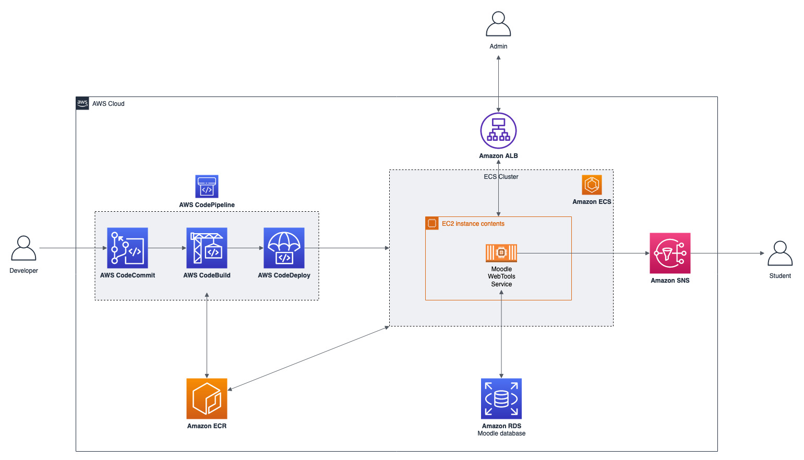

# AWS Brasil - Conteúdo da série de Webinars para Educação apresentandos em 2020

## Containers e como usar os serviços da AWS em seu LMS/EAD (28/05)

Para esse webinar criamos uma API desenvolvida em Python utilizando **containers** e **desacoplada** da nossa aplicação Moodle (https://moodle.awsunicorn.com). Essa API efetua consultas na base de dados do Moodle e envia notificações para os alunos através do serviço **Amazon SNS**. Você pode visualizar as funcionalidades da API através dos seguitnes comandos:

```
curl -X GET http://moodle-services.awsunicorn.com/get_students/

curl -X POST http://moodle-services.awsunicorn.com/notify_students/
```

_Obs.: Esse serviço que estamos criando é para fins de demonstração. Para não sobrecarregar a base de dados poderiamos criar uma Read Replica e para não criar inconsistência no banco de dados não deve ser feita nenhuma escrita._

</br>
<p align="center"></p>
</br>

### Pré-requisitos

- Assistir o [webinar-01](../webinar-01/) (recomendado);
- Assistir o [webinar-04](../webinar-04/) (recomendado);
- Python 3.6+;
- virtualenv;
- Docker;
- Criar um tópico SNS (https://docs.aws.amazon.com/pt_br/AmazonCloudWatch/latest/monitoring/US_SetupSNS.html);
- Cria uma IAM Role com acesso ao SNS para a task do ECS (https://docs.aws.amazon.com/pt_br/AmazonECS/latest/developerguide/task-iam-roles.html);
- Criar um ALB ou utilizar o existe feito no webinar-01;

### Executando a aplicação local

1. Crie um ambiente virtual com o virtualenv:

   ```
   virtualenv venv

   source venv/bin/activate
   ```

2. Instale as dependências do Python:
   ```
   pip install -r requirements.txt
   ```
3. Modifique as informações do seu banco de dados e do tópico SNS:

   - arquivo src/service/moodle_service.py
   - arquivo src/service/notify_service.py

4. Execute a aplicação:
   ```
   python moodleservices.py
   ```
5. Verifique se a API está respondendo:
   ```
    curl -X GET localhost:5000/health/
   ```

### Efetuando o push da imagem Docker para a AWS

1. Crie um repositório no ECR (Elastic Container Registry) com o nome de **moodle-services**;
   - https://docs.aws.amazon.com/pt_br/AmazonECR/latest/userguide/repository-create.html
2. Faça o build da imagem e após isso efetue o push para o ECR:

   ```
   docker build -t moodle-services .

   docker tag moodle-services:latest <YOUR AWS ACCOUNT ID>.dkr.ecr.<YOUR AWS REGION>.amazonaws.com/moodle-services:latest

   aws ecr get-login-password --region <YOUR AWS REGION> | docker login --username AWS --password-stdin <YOUR AWS ACCOUNT ID>.dkr.ecr.<YOUR AWS REGION>.amazonaws.com

   docker push <YOUR AWS ACCOUNT ID>.dkr.ecr.<YOUR AWS REGION>.amazonaws.com/moodle-services:latest
   ```

### Orquestrando com ECS

Nesta etapa iremos criar um Cluster, Task Definition e um Service no ECS.


1. Crie um cluster EC2 Linux + Networking na console do ECS (https://docs.aws.amazon.com/pt_br/AmazonECS/latest/developerguide/create_cluster.html);
2. Crie uma Task Definition e utilize a **URI** da imagem no ECR (https://docs.aws.amazon.com/pt_br/AmazonECS/latest/developerguide/create-task-definition.html);
   - Em **Task Role** utilize a Role criada como pré-requisito dessa demonstração;
   - Em **Task Memory** utilize 512 MB e **Task CPU** utilize 256;
   - Em **Add Container** cole a **URI** da sua imagem Docker.Após isso no mapeamento de porta adicionar a porta _80_ como **Host Port** e a porta _5000_ como **Container Port**;
3. Crie um Service no seu Cluster (https://docs.aws.amazon.com/pt_br/AmazonECS/latest/developerguide/create-service.html):
   - Na **Task Definition** seleciona a criada anteriormente;
   - Em **Number of Tasks** coloque 1;
   - Selecione o seu **Application Load Balancer** (Se necessário crie uma rota por path ou por host no ALB);
   - Desabilite o **Discovery Integration**;
4. Para testar, utilize o endpoint do ALB:

   ```
   curl -X GET http://<ALB ENDPOINT>/health/
   curl -X GET http://<ALB ENDPOINT>/get_students/
   curl -X POST http://<ALB ENDPOINT>/notify_students/
   ```

## Referências

- [O que é um container?](https://aws.amazon.com/pt/containers/)
- [Amazon Elastic Container Service](https://aws.amazon.com/pt/ecs/)
- [Dividir um aplicativo monolítico em microsserviços](https://aws.amazon.com/pt/getting-started/hands-on/break-monolith-app-microservices-ecs-docker-ec2/)
