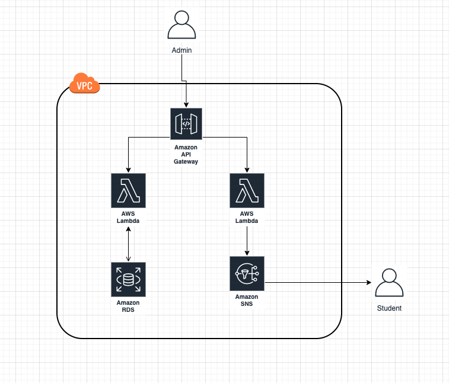

# AWS Brasil - Conteúdo da série de Webinars para Educação apresentandos em 2020

## Serverless - Modernizando o seu LMS/EAD com serviços gerenciados da AWS (04/06)

Para esse webinar criamos uma API desenvolvida em Python utilizando **api gateway** e **lambda**, e **desacoplada** da nossa aplicação Moodle (https://moodle.awsunicorn.com). Essa API efetua consultas na base de dados do Moodle e envia notificações para os alunos através do serviço **Amazon SNS**. Essa arquitetura é uma evolução da arquitetura apresentada no webinar passado (webinar-05) onde mudamos ambos serviços que rodavam em um unico container para um serviço ainda mais desacoplado onde temos funções como serviço e servidores gerenciados pela AWS. Você pode visualizar as funcionalidades da API através dos seguitnes comandos:

```
curl -X GET https://fblgbivqgk.execute-api.us-east-1.amazonaws.com/v1/get-students/

curl -X POST https://fblgbivqgk.execute-api.us-east-1.amazonaws.com/v1/notify-students
```

_Obs.: Esse serviço que estamos criando é para fins de demonstração. Para não sobrecarregar a base de dados poderiamos criar uma Read Replica e para não criar inconsistência no banco de dados não deve ser feita nenhuma escrita._


</br>
<p align="center"></p>
</br>


### Pré-requisitos

- Assistir o [webinar-01](../webinar-01/) (recomendado);
- Assistir o [webinar-04](../webinar-04/) (recomendado);
- Python 3.6+;
- virtualenv;
- Criar um tópico SNS (https://docs.aws.amazon.com/pt_br/AmazonCloudWatch/latest/monitoring/US_SetupSNS.html);
- Criar uma IAM Role com acesso ao SNS para a lambda (https://docs.aws.amazon.com/pt_br/AmazonECS/latest/developerguide/task-iam-roles.html);
- Criar uma API REST no API Gateway;


### Criando a lambda de listagem de usuários

1. Crie um ambiente virtual com o virtualenv:
   ```
   virtualenv venv

   source venv/bin/activate
   ```
 2. Instale as dependências do MySQL:
   ```
   pip install pymysql

   ```
 3. Mova a biblioteca do MySQL para o diretório raiz da aplicação:
   ```
   mv venv/lib/python3.8/site-packages/pymysql .

   ```
 4. Saia do ambiente virtual:
  ```
   deactivate
   ```
 5. Remova a pasta do virtualenv criada:
  ```
   rm -r venv
   ```
 6. Crie um arquivo com o nome de lambda_function.py nesse mesmo diretório e utilize o código que se encontra na pasta **src**. Altere os endpoints para o seu banco de dados
 
 7. Compacte a biblioteca do MySQL junto da função lambda:
 ```
   zip -r lambda *
   ```
 8. No console da AWS, crie uma nova função lambda e utilize uma role com acesso de leitura ao RDS. Então faça o upload do arquivo zipado para sua função lambda.
 
 9. Precisamos configurar corretamente as configurações de VPC da nossa função lambda, para a visibilidade de nossa VPC precisamos adicionar as configurações da VPC, subnets e security-groups para a nossa função criada.
 
 
