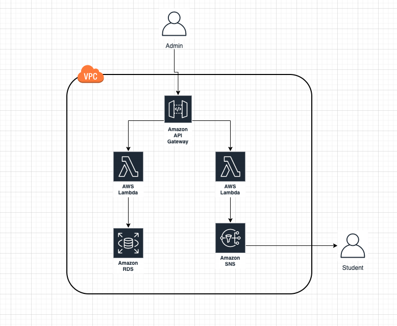

# AWS Brasil - Conteúdo da série de Webinars para Educação apresentandos em 2020

## Serverless - Modernizando o seu LMS/EAD com serviços gerenciados da AWS (04/06)

Para esse webinar criamos uma API desenvolvida em Python utilizando **api gateway** e **lambda**, e **desacoplada** da nossa aplicação Moodle (https://moodle.awsunicorn.com). Essa API efetua consultas na base de dados do Moodle e envia notificações para os alunos através do serviço **Amazon SNS**. Essa arquitetura é uma evolução da arquitetura apresentada no webinar passado (webinar-05) onde mudamos ambos serviços que rodavam em um unico container para um serviço ainda mais desacoplado onde temos funções como serviço e servidores gerenciados pela AWS. Você pode visualizar as funcionalidades da API através dos seguitnes comandos:

```
curl -X GET https://fblgbivqgk.execute-api.us-east-1.amazonaws.com/v1/get-students/

curl -X POST https://fblgbivqgk.execute-api.us-east-1.amazonaws.com/v1/notify-students
```

_Obs.: Esse serviço que estamos criando é para fins de demonstração. Para não sobrecarregar a base de dados poderiamos criar uma Read Replica e para não criar inconsistência no banco de dados não deve ser feita nenhuma escrita._


</br>
<p align="center"></p>
</br>


### Pré-requisitos

- Assistir o [webinar-01](../webinar-01/) (recomendado);
- Assistir o [webinar-04](../webinar-04/) (recomendado);
- Python 3.6+;
- virtualenv;
- Criar um tópico SNS (https://docs.aws.amazon.com/pt_br/AmazonCloudWatch/latest/monitoring/US_SetupSNS.html);
- Criar uma IAM Role com acesso ao SNS para a lambda (https://docs.aws.amazon.com/pt_br/AmazonECS/latest/developerguide/task-iam-roles.html);
- Criar uma API REST no API Gateway;


### Criando a lambda de listagem de estudantes

1. Crie um ambiente virtual com o virtualenv:
   ```
   virtualenv venv

   source venv/bin/activate
   ```
 2. Instale as dependências do MySQL:
   ```
   pip install pymysql

   ```
 3. Mova a biblioteca do MySQL para o diretório raiz da aplicação:
   ```
   mv venv/lib/python3.8/site-packages/pymysql .

   ```
 4. Saia do ambiente virtual:
  ```
   deactivate
   ```
 5. Remova a pasta do virtualenv criada:
  ```
   rm -r venv
   ```
 6. Crie um arquivo com o nome de lambda_function.py nesse mesmo diretório e utilize o código que se encontra na pasta **src**. Altere os endpoints para o seu banco de dados
 
 7. Compacte a biblioteca do MySQL junto da função lambda:
 ```
   zip -r lambda *
   ```
 8. No console da AWS, crie uma nova função lambda e utilize uma role com acesso de leitura ao RDS. Então faça o upload do arquivo zipado para sua função lambda.
 
 9. Precisamos configurar corretamente as configurações de VPC da nossa função lambda, para a visibilidade de nossa VPC precisamos adicionar as configurações da VPC, subnets e security-groups para a nossa função criada.
 
 
 #### Podemos incluir as dependências de uma biblioteca em uma camada do lambda.
 
 Essa é uma forma alternativa de empacotar o código lambda junto com as dependências necessárias em um único zip e subir para sua função.
 
 1. Compacte a biblioteca em um arquivo .zip
 2. No console da lambda clique na aba de layers
 3. Crie uma nova layer e configure corretamente o ambiente de execução, então faça upload do arquivo .zip
 4. Abra sua função lambda e clique para adicionar layers existentes à sua lambda, selecione então nossa layer criada
 5. Pronto, agora você já possui a dependência importada através de uma camada do lambda. Portanto só é necessário subir o seu código fonte da função.
 
 ### Criando a lambda de notificação de estudantes
 
 1. No console da AWS crie uma nova lambda e adicione uma role com acesso total ao serviço SNS
 
 2. Copie o código de notificar os estudantes que se encontra na pasta **src** e modifique o tópico SNS para o seu cadastrado.
 
 3. Não precisaremos alterar as configurações da VPC, visto que não precisamos ter visibilidade para acessar uma subnet onde está um servico de banco de dados por exemplo
 
 ### Criando o API Gateway
 
 1. No console da AWS adicione um novo API Gateway e selecione uma nova API do tipo REST
 
 2. Na aba de recursos clique em **/** e adicione um novo recurso. Escolha um nome para seu recurso
 
 3. Adicione um novo metódo para seu recurso do tipo **GET** e então selecione o tipo de integração com a função lambda que criamos para listagem de estudantes.
 
 4. Repita o processo de 1 a 3 para criar um recurso e método (selecione metódo **POST**) para expormos a lambda de notificar os estudantes.
 
 5. Faça o deploy da API e veja na aba de stages a sua URL do API Gateway que expõe suas funções lambdas.


## Referências

- [O que é uma arquitetura sem servidor?](https://aws.amazon.com/pt/lambda/serverless-architectures-learn-more/)
- [AWS Lambda](https://aws.amazon.com/pt/lambda/)
- [Developer guide AWS Lambda](https://docs.aws.amazon.com/lambda/latest/dg/welcome.html)
- [AWS Lambda Layers](https://docs.aws.amazon.com/pt_br/lambda/latest/dg/configuration-layers.html)
